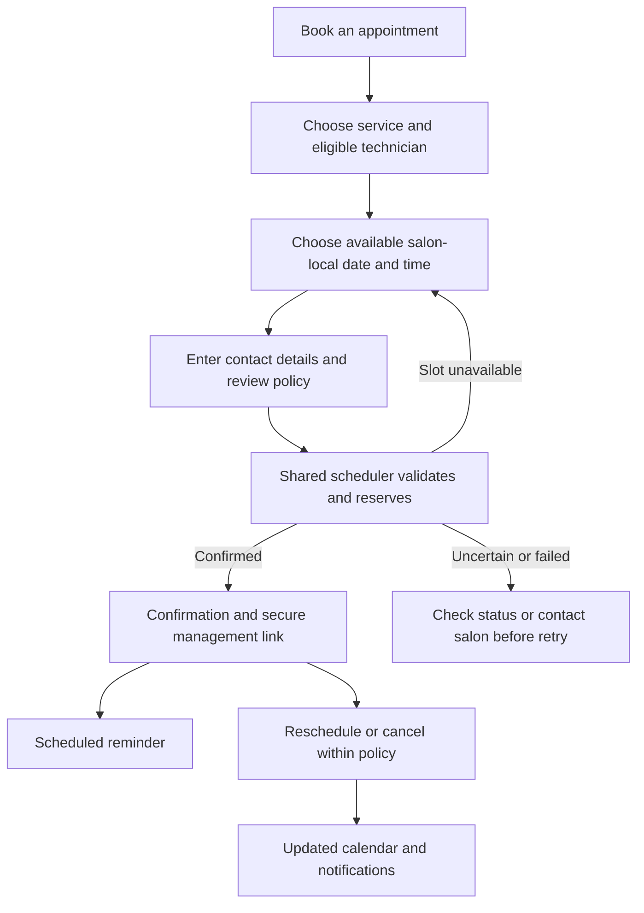

# Product plan

Date: September 6, 2026. Status: proposed MVP, awaiting scope approval.

## Purpose and audience

Help local customers discover Madison Hill Nails, understand its services and prices, and reserve a real appointment from a phone. Give returning customers a simple way to manage appointments. Give salon staff one reliable schedule covering online, telephone, and walk-in appointments.

Primary audiences: new local visitors comparing salons; returning customers ready to book; staff managing capacity. Launch with one location, English content, and appointment times explicitly shown in `America/New_York`. Language expansion depends on owner input.

Owner clarification: appointments are currently managed manually; the website will be hosted on Netlify and is expected to have low traffic. Initial and monthly budgets are undecided. The latest scope requires a custom admin dashboard and payment/cancellation-fee controls built in MVP but disabled initially. This supersedes the earlier plan to defer payment implementation.

## Scope boundaries

The user requires scheduling in the MVP. This proposal also includes guest rescheduling/cancellation and basic email confirmations/reminders at launch. Under the latest custom-backend recommendation, our shared API and notification service provide these flows; a managed scheduler is an alternative pending architecture approval. SMS remains conditional on owner approval. These additions are recommendations, not yet approved requirements.

Initial recommendation: one customer and one service or a predefined service bundle per appointment; any suitable technician or a specific technician if supported. Confirm whether combinations such as manicure plus pedicure require multiple staff or shared chairs before selecting the provider. Complex group bookings are a later phase unless essential to daily operations.

## Public website features

| ID | MVP feature | Acceptance criterion |
| --- | --- | --- |
| W01 | Responsive homepage | Usable at 320px through desktop widths, with no horizontal overflow or concealed controls. |
| W02 | Header and section navigation | Logo/name, service/gallery/visit anchors, and Book button work with keyboard and touch; sticky header does not cover anchor headings. |
| W03 | Hero and local introduction | Clearly identifies the salon and Madison, NJ; prominent booking action and secondary service link. No unsupported claims. |
| W04 | Service menu | Every bookable service has an approved name, description, price or clearly explained starting price, duration, and relevant add-ons/removal charges. |
| W05 | Nail gallery | Approximately 8–12 approved images with useful alternative text; no required social login. Enlarged view, if included, supports keyboard dismissal and focus return. |
| W06 | Salon story | Owner-approved introduction and real salon imagery. Staff bios optional until assets are available. |
| W07 | Reviews and social links | Confirmed profile links; show attributed excerpts only when publication is approved and reuse is permitted. Launch can use profile links without excerpts. |
| W08 | Visit and contact | Verified address, hours, holiday exceptions, phone link, and directions; parking/accessibility details only after confirmation. |
| W09 | FAQ | Approved answers about appointments, walk-ins, removal, late arrival, cancellations, payments, and service preparation. |
| W10 | Booking entry points | Header, service section, final section, and mobile sticky CTA reach the same real scheduler. Sticky CTA respects device safe areas and does not obscure content. |
| W11 | Policy pages | Privacy and booking policies are readable, linked from the footer and booking flow, and reflect actual operations. |
| W12 | Reliability states | Broken routes show a helpful 404; a failed booking embed offers the provider's direct link and verified phone number. |
| W13 | SEO foundation | Approved local content in rendered HTML, metadata, canonical URLs, sitemap, robots rules, business structured data, and crawlable navigation. See design plan. |
| W14 | Measurement | Record booking-link, phone, and directions clicks without customer data; count completed bookings only if a reliable provider callback/report exists. |

## Appointment and staff features

| ID | MVP feature | Acceptance criterion |
| --- | --- | --- |
| B01 | Service selection | Selection carries correct duration, price, add-ons, and eligible staff into the scheduler; no hidden fee introduced only at confirmation. |
| B02 | Real availability | Availability reflects staff hours, time off, existing appointments, buffers, lead time, booking horizon, and any required shared resources. |
| B03 | Date/time selection | Times explicitly identify salon local time; unavailable and fully booked states offer another date or contact path. |
| B04 | Guest booking | Customers can book without creating a separate website account. Required provider login, if any, must be evaluated before approval. |
| B05 | Customer details | Collect only necessary name and contact details; optional notes are clearly labeled; policy acknowledgement is visible before submission. |
| B06 | Reliable reservation | A success message appears only after the authoritative scheduler confirms the appointment. Repeated submissions and competing attempts cannot silently create duplicates or overlaps. |
| B07 | Confirmation | Customer receives service, date/time, location, booking reference, and management instructions. Staff see the same appointment. |
| B08 | Reschedule/cancel | Verified customer or secure provider link can modify/cancel within the policy. Expired links and cutoff violations offer a clear staff contact path. |
| B09 | Reminder | Proposed email reminder about 24 hours before the appointment; owner chooses timing. Changes/cancellations suppress obsolete reminders. SMS only if approved and supported. |
| B10 | Staff calendar | Staff can create telephone/walk-in bookings, edit appointments, block time, record cancellations/no-shows, and view relevant customer details. |
| B11 | Custom administrative setup | Owner manages appointments, availability, and policy settings through a private dashboard within the website. Required operations use server-authorized APIs; no separate unsynchronized admin calendar. |
| B12 | Appointment states | Staff and customer messages distinguish requested versus confirmed appointments if manual approval is enabled; canceled/no-show/completed states are reflected accurately. |
| B13 | Configurable payment protection | Build payment requirements and late-cancellation fees in MVP, initially off. Off mode books without collecting payment/card details; enabled mode enforces the approved policy. No live charges until activation is approved. |
| B14 | Staff access | Individual admin accounts and server-enforced roles; owner-only payment/policy settings and authorized fee waiver/refund actions. |
| B15 | Manual appointment availability | Adding an appointment blocks its full staff/resource interval online immediately; changes move the block and cancellation releases it. Competing admin/online writes cannot silently overbook. |

The [custom admin and payment specification](08-admin-and-payment-controls.md) defines detailed requirements A01–A12, policy versioning, fee processing, and acceptance cases. Card-on-file with no upfront charge is confirmed. Fee amount, cutoff, and enforcement rules remain open; approximately one week is a proposed configurable window, not a finalized policy.

## Booking journey

## Deferred features

Native mobile apps; custom customer accounts/dashboard; loyalty and referrals; gift card sales; online product sales; memberships; waitlists; group/bridal bookings; advanced multi-service allocation; multilingual content; staff payroll/inventory tools; marketing campaigns; custom SMS/push campaigns. The appointment admin dashboard, payment/fee controls, and proposed basic email notifications are in MVP. Move other features into MVP only when an operational need justifies implementation and cost.

Live payment/fee activation is deferred; implementation is included. Both controls start disabled. No payment details are requested while disabled, and confirmations must reflect actual payment status. A separate no-show fee rule has not been requested or approved and must not be inferred from the late-cancellation policy.

## Success measures

Track website-to-booking clicks, provider-confirmed online bookings, abandonment where measurable, phone/directions use, scheduling errors, and staff-reported workload. Establish conversion and no-show baselines during the first 30 days; set improvement targets from observed data. Do not label a booking-button click as a completed appointment.
