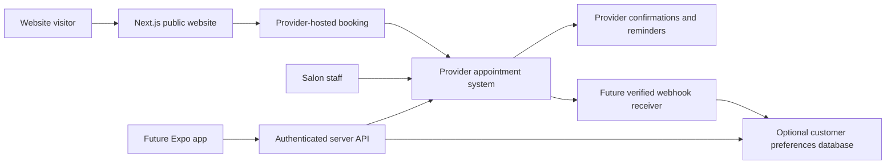

# Technology and scheduling recommendation

Researched September 6, 2026. Hosting on Netlify and no online payments in MVP are owner decisions. Other technology/provider selections remain proposals; verify vendor plans again before purchase or implementation. Scheduling is currently manual and the budget is undecided.

## Recommended starting stack

| Layer | Proposal | Why and tradeoff |
| --- | --- | --- |
| Website | Next.js App Router + TypeScript | Pre-rendered marketing content plus a future server boundary for booking integrations. Built-in [metadata support](https://nextjs.org/docs/app/getting-started/metadata-and-og-images). More complexity than a purely static site, justified if the custom app roadmap proceeds. |
| Styling | Tailwind CSS + CSS design tokens | Consistent responsive layout and brand colors through [theme variables](https://tailwindcss.com/docs/theme). Custom design still needs deliberate typography and composition. |
| Motion | CSS first | Small decorative effects with reduced-motion support. Add a motion dependency only if an approved effect requires it. |
| Booking | Evaluate Square first, with Acuity as an alternative | Introduce one digital calendar for the currently manual workflow. Hosted booking constrains branding but reduces launch complexity. Require booking without card/payment collection. |
| Content | Typed local content for launch | Simple, reviewable changes in GitHub. Owner edits require a developer initially; choose a CMS during planning if independent editing is a launch requirement. |
| Hosting | Netlify — owner selected | [Netlify supports Next.js through OpenNext](https://docs.netlify.com/build/frameworks/framework-setup-guides/nextjs/overview/), including App Router, caching, and image optimization. Evaluate Free for low usage; paid-plan choice requires owner approval. |
| Version control | GitHub | Documentation and code history, reviewable changes, and later CI. No repository visibility or account assumption. |
| Validation | TypeScript/lint/build; focused browser and accessibility checks | Validate critical journeys and vendor integration, plus metadata/performance. Tool versions will be selected when building is approved. |
| Future backend | Server API + managed PostgreSQL, Supabase candidate | Add only for custom accounts, notification preferences, or app-specific data. [Row-level security](https://supabase.com/docs/guides/database/postgres/row-level-security) can support per-customer access; policy correctness still needs testing. |
| Future native app | React Native + Expo + TypeScript | [Expo](https://docs.expo.dev/) supports Android, iOS, and web development. Share types, validation, and API contracts; native screens still require separate design and implementation. |

No custom database is required for a launch that uses provider-hosted scheduling. Avoid duplicating appointment ownership in a second calendar. Keep customer accounts and the scheduling provider as distinct concepts: provider customer IDs alone do not establish authenticated ownership.

### Netlify deployment approach

Keep the proposed Next.js + TypeScript + Tailwind stack, with public content pre-rendered and lightweight client interactions. Use Netlify's supported Next.js adapter and validate its build output at implementation time. Pre-rendering through the adapter is not a promise of zero function invocations. Avoid unnecessary per-request rendering, live social feeds, or background jobs for the marketing site. Prefer responsive compressed images and provider-hosted scheduling. [Netlify Next.js documentation](https://docs.netlify.com/build/frameworks/framework-setup-guides/nextjs/overview/).

The future mobile app can use a separately secured API without changing the public website's host. Hosting handles delivery of the website; the booking provider handles appointments, staff calendars, and provider reminders. A generic form submission is not a confirmed reservation and is not a substitute for checking availability and reserving capacity.

After deployment approval, connect the intended GitHub branch, verify previews and production publishing behavior, and validate redirects, metadata, images, and booking links on Netlify. Keep any future server credentials in approved Netlify environment settings, with suitable scopes; never commit `.env` files or expose secrets to browser bundles. Do not create a Netlify site, enable paid options, or configure automatic production publication during planning.

Alternatives: a static-first framework such as Astro is worth evaluating if scope stays a brochure site plus external booking. A visual site builder with hosted booking may suit owner editing, but should be assessed against GitHub workflow, exportability, SEO controls, and the planned custom app. A fully custom scheduler gives control at the cost of capacity rules, concurrency, notifications, staff tools, and long-term support; it is not the proposed MVP.

## Provider shortlist

| Candidate | Verified capabilities | Main question before selection |
| --- | --- | --- |
| Square Appointments | Hosted booking entry/widgets; availability and create/update/cancel API operations; staff scheduling and appointment communications | Which plan fits staff/resource needs and later API writes? Demonstrate no-payment booking and staff adoption before selection. |
| Acuity Scheduling | Embedded scheduler, availability/appointment API, and appointment webhooks; email reminders, with SMS and API access depending on plan | Does a calendar per staff/resource match the salon? Custom API access is listed in Premium. |
| Fresha | Direct website booking links, team scheduling plans, reminders, and a consumer booking app | A public custom booking API suitable for our branded app was not verified. Obtain vendor confirmation of access, terms, and export before choosing for that roadmap. |

Square's [Bookings API documentation](https://developer.squareup.com/docs/bookings-api/what-it-is) distinguishes buyer-level operations from seller-level writes; the latter require eligible paid subscription access and permissions. Do not assume a free hosted booking setup guarantees future access to all appointments. Its [hosted booking documentation](https://api.squareup.com/help/us/en/article/5355-set-up-online-booking-with-square-appointments) supports website booking links/widgets.

Acuity provides [developer documentation](https://developers.acuityscheduling.com/), [change webhooks](https://developers.acuityscheduling.com/docs/webhooks), and documented [create/cancel/reschedule API use](https://help.acuityscheduling.com/hc/en-us/articles/16676949253389-Using-custom-CSS-and-APIs). Fresha documents [direct booking integration](https://www.fresha.com/help-center/academy/get-booked-online/accept-online-bookings/lessons/100349); its consumer app is not equivalent to a custom Madison Hill Nails app.

Recommendation: because the current process is manual, evaluate a new scheduler against real salon scenarios, starting with Square and comparing Acuity. Start with the least expensive plan that passes required staff/resource and no-payment booking checks. Defer selection until staffing and service complexity are known. Do not subscribe to a higher API tier just for a mobile app that has not been approved yet; document its future upgrade path instead.

## Provider evaluation gate

After explicit approval for a sandbox/trial, demonstrate:

- Guest booking on a phone; accurate service price and duration, removal/add-ons, and eligible technician assignment.
- Successful booking without card details, online payment, deposit, or preauthorization; preserve existing in-person payment practices.
- Two customers competing for one slot; a phone appointment competing with online booking; no silent overbooking.
- Manicure/pedicure combinations, buffers, chairs or other shared resources, and any multi-staff service.
- Staff breaks, holidays, minimum notice, maximum advance window, and Eastern time/DST behavior.
- Rescheduling and cancellation within and outside policy; original appointment preserved if a proposed move fails.
- Confirmations/reminders after booking, editing, canceling, and staff changes; a failed notification does not remove a successful booking.
- API rights to create, modify, and cancel the required appointments, including ones staff created; signed webhooks and export capabilities.
- Accessible mobile flow, usable fallback link, provider outage behavior, costs at actual staff count, and owner account ownership.

## Architecture by phase

Nodes explicitly labeled “Future” or “Optional,” plus the authenticated API, belong to later custom integration. No backend or app is being provisioned now.

Future API responsibilities: authenticate the customer; authorize ownership of each appointment; keep provider credentials server-side; validate requests; rate-limit abuse; use idempotency where supported; check provider versions/conflicts; verify webhook signatures; deduplicate events; reconcile missed/out-of-order events; redact sensitive logs. Provider is authoritative for appointment state. A provider adapter can isolate vendor-specific code but does not eliminate migration work.

For a future custom reminder service, store appointment version, channel, consent/preferences, intended send time, and delivery state. Recheck the live appointment before sending, invalidate jobs after changes, and avoid duplicate provider/custom messages. A durable server-side worker sends reminders, independent of whether the mobile app is open. Push is optional with an email/SMS fallback according to customer settings. Review communication requirements when choosing channels; do not invent legal policy in this planning phase.

## Operating cost snapshot

USD, published prices observed September 6, 2026; excludes tax, payment processing, usage overages, implementation, maintenance, and optional purchases. These are planning inputs, not quotes.

| Component | Published starting point / budget treatment | Source |
| --- | --- | --- |
| Netlify | Free $0/month with 300 credits; Personal $9/month with 1,000 credits; Pro starts at $20/month with 3,000 credits. Confirm the owner's actual plan, including any legacy terms. | [Netlify pricing](https://www.netlify.com/pricing/) |
| Square | Free $0; Plus $49/location/month; Premium $149/location/month. Confirm current/legacy account entitlements and booking features. | [Square pricing](https://squareup.com/us/en/appointments/pricing) |
| Acuity | Monthly billing: Starter $20, Standard $34, Premium $61; annual equivalents $16/$27/$49 per month. Premium lists custom API; Standard/Premium list text reminders. | [Acuity pricing](https://www.acuityscheduling.com/pricing?btn=nav&entry_point=acuity) |
| Fresha | Independent $19.95/month; Team $14.95/bookable team member/month. Marketplace-acquired new clients carry a stated 20% one-time fee, minimum $6; distinguish direct bookings. | [Fresha pricing](https://www.fresha.com/pricing) |
| Domain | Domain-specific quote needed, including renewal; availability not checked | Pending domain choice |
| Photography, CMS, analytics, custom backend, app distribution | Quote only if selected; no subscriptions proposed for purchase now | Pending scope |

Budget approach: keep hosting, scheduling, domain renewal, implementation, and optional maintenance separate. The owner has not set a spending cap; this does not authorize spending. Netlify Free plus a qualifying Square Free setup would have a $0 base monthly subscription; that is a conditional scenario, not a promise that free plans meet salon requirements. If Square Plus is needed, its base subscription is $49/month plus the chosen hosting plan. Acuity Standard on monthly billing is $34/month plus hosting if its calendar limits fit; API access for a later custom app may require an upgrade. Domain, usage charges, and other exclusions above remain separate.

Netlify usage is not determined solely by visitor count: metered usage includes production deployments, bandwidth, requests, and compute. Its published pricing says exhausted limits can pause projects; keep usage monitoring in the launch checklist. Evaluate Free before selecting a paid plan and leave paid recharge/purchases unapproved until the owner decides. [Netlify pricing and usage FAQ](https://www.netlify.com/pricing/).
