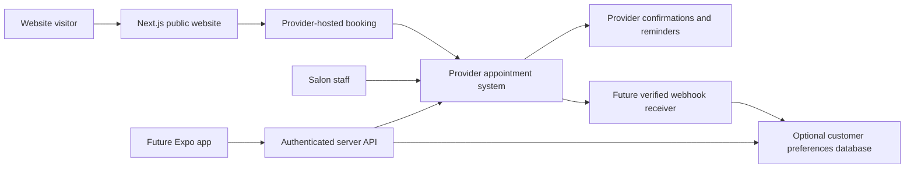

# Technology and scheduling recommendation

Researched September 6, 2026. All selections remain proposals; verify vendor plans again before purchase or implementation.

## Recommended starting stack

| Layer | Proposal | Why and tradeoff |
| --- | --- | --- |
| Website | Next.js App Router + TypeScript | Pre-rendered marketing content plus a future server boundary for booking integrations. Built-in [metadata support](https://nextjs.org/docs/app/getting-started/metadata-and-og-images). More complexity than a purely static site, justified if the custom app roadmap proceeds. |
| Styling | Tailwind CSS + CSS design tokens | Consistent responsive layout and brand colors through [theme variables](https://tailwindcss.com/docs/theme). Custom design still needs deliberate typography and composition. |
| Motion | CSS first | Small decorative effects with reduced-motion support. Add a motion dependency only if an approved effect requires it. |
| Booking | Existing suitable provider, otherwise evaluate Square first | Keeps availability, staff management, and appointment notifications in one system. Hosted booking constrains branding but reduces launch complexity. |
| Content | Typed local content for launch | Simple, reviewable changes in GitHub. Owner edits require a developer initially; choose a CMS during planning if independent editing is a launch requirement. |
| Hosting | Vercel Pro candidate | Fits Next.js and Git-based previews. [Hobby is restricted to personal noncommercial use](https://vercel.com/docs/plans/hobby), so do not budget free Hobby hosting for this salon. |
| Version control | GitHub | Documentation and code history, reviewable changes, and later CI. No repository visibility or account assumption. |
| Validation | TypeScript/lint/build; focused browser and accessibility checks | Validate critical journeys and vendor integration, plus metadata/performance. Tool versions will be selected when building is approved. |
| Future backend | Server API + managed PostgreSQL, Supabase candidate | Add only for custom accounts, notification preferences, or app-specific data. [Row-level security](https://supabase.com/docs/guides/database/postgres/row-level-security) can support per-customer access; policy correctness still needs testing. |
| Future native app | React Native + Expo + TypeScript | [Expo](https://docs.expo.dev/) supports Android, iOS, and web development. Share types, validation, and API contracts; native screens still require separate design and implementation. |

No custom database is required for a launch that uses provider-hosted scheduling. Avoid duplicating appointment ownership in a second calendar. Keep customer accounts and the scheduling provider as distinct concepts: provider customer IDs alone do not establish authenticated ownership.

Alternatives: a static-first framework such as Astro is worth evaluating if scope stays a brochure site plus external booking. A visual site builder with hosted booking may suit owner editing, but should be assessed against GitHub workflow, exportability, SEO controls, and the planned custom app. A fully custom scheduler gives control at the cost of capacity rules, concurrency, notifications, staff tools, and long-term support; it is not the proposed MVP.

## Provider shortlist

| Candidate | Verified capabilities | Main question before selection |
| --- | --- | --- |
| Square Appointments | Hosted booking entry/widgets; availability and create/update/cancel API operations; staff scheduling and appointment communications | Does the salon already use Square? Which plan permits required API writes and capacity rules? Test the actual account. |
| Acuity Scheduling | Embedded scheduler, availability/appointment API, and appointment webhooks; email reminders, with SMS and API access depending on plan | Does a calendar per staff/resource match the salon? Custom API access is listed in Premium. |
| Fresha | Direct website booking links, team scheduling plans, reminders, and a consumer booking app | A public custom booking API suitable for our branded app was not verified. Obtain vendor confirmation of access, terms, and export before choosing for that roadmap. |

Square's [Bookings API documentation](https://developer.squareup.com/docs/bookings-api/what-it-is) distinguishes buyer-level operations from seller-level writes; the latter require eligible paid subscription access and permissions. Do not assume a free hosted booking setup guarantees future access to all appointments. Its [hosted booking documentation](https://api.squareup.com/help/us/en/article/5355-set-up-online-booking-with-square-appointments) supports website booking links/widgets.

Acuity provides [developer documentation](https://developers.acuityscheduling.com/), [change webhooks](https://developers.acuityscheduling.com/docs/webhooks), and documented [create/cancel/reschedule API use](https://help.acuityscheduling.com/hc/en-us/articles/16676949253389-Using-custom-CSS-and-APIs). Fresha documents [direct booking integration](https://www.fresha.com/help-center/academy/get-booked-online/accept-online-bookings/lessons/100349); its consumer app is not equivalent to a custom Madison Hill Nails app.

Recommendation: retain the existing system if it meets the launch and future API requirements. Otherwise, trial Square against real salon scenarios, with Acuity as the alternative. Defer selection until staffing and service complexity are known.

## Provider evaluation gate

After explicit approval for a sandbox/trial, demonstrate:

- Guest booking on a phone; accurate service price and duration, removal/add-ons, and eligible technician assignment.
- Two customers competing for one slot; a phone appointment competing with online booking; no silent overbooking.
- Manicure/pedicure combinations, buffers, chairs or other shared resources, and any multi-staff service.
- Staff breaks, holidays, minimum notice, maximum advance window, and Eastern time/DST behavior.
- Rescheduling and cancellation within and outside policy; original appointment preserved if a proposed move fails.
- Confirmations/reminders after booking, editing, canceling, and staff changes; a failed notification does not remove a successful booking.
- API rights to create, modify, and cancel the required appointments, including ones staff created; signed webhooks and export capabilities.
- Accessible mobile flow, usable fallback link, provider outage behavior, costs at actual staff count, and owner account ownership.

## Architecture by phase

Nodes explicitly labeled “Future” or “Optional,” plus the authenticated API, belong to later custom integration. No backend or app is being provisioned now.

Future API responsibilities: authenticate the customer; authorize ownership of each appointment; keep provider credentials server-side; validate requests; rate-limit abuse; use idempotency where supported; check provider versions/conflicts; verify webhook signatures; deduplicate events; reconcile missed/out-of-order events; redact sensitive logs. Provider is authoritative for appointment state. A provider adapter can isolate vendor-specific code but does not eliminate migration work.

For a future custom reminder service, store appointment version, channel, consent/preferences, intended send time, and delivery state. Recheck the live appointment before sending, invalidate jobs after changes, and avoid duplicate provider/custom messages. A durable server-side worker sends reminders, independent of whether the mobile app is open. Push is optional with an email/SMS fallback according to customer settings. Review communication requirements when choosing channels; do not invent legal policy in this planning phase.

## Operating cost snapshot

USD, published prices observed September 6, 2026; excludes tax, payment processing, usage overages, implementation, maintenance, and optional purchases. These are planning inputs, not quotes.

| Component | Published starting point / budget treatment | Source |
| --- | --- | --- |
| Vercel Pro | $20/month starting price; seats and usage may add cost | [Vercel pricing](https://vercel.com/pricing) |
| Square | Free $0; Plus $49/location/month; Premium $149/location/month. Confirm current/legacy account entitlements and booking features. | [Square pricing](https://squareup.com/us/en/appointments/pricing) |
| Acuity | Monthly billing: Starter $20, Standard $34, Premium $61; annual equivalents $16/$27/$49 per month. Premium lists custom API; Standard/Premium list text reminders. | [Acuity pricing](https://www.acuityscheduling.com/pricing?btn=nav&entry_point=acuity) |
| Fresha | Independent $19.95/month; Team $14.95/bookable team member/month. Marketplace-acquired new clients carry a stated 20% one-time fee, minimum $6; distinguish direct bookings. | [Fresha pricing](https://www.fresha.com/pricing) |
| Domain | Domain-specific quote needed, including renewal; availability not checked | Pending domain choice |
| Photography, CMS, analytics, custom backend, app distribution | Quote only if selected; no subscriptions proposed for purchase now | Pending scope |

Illustrative baseline: Vercel Pro plus Square Plus starts around **$69/month**; Vercel Pro plus monthly Acuity Premium around **$81/month**, before the exclusions above. Using a lower provider tier for hosted MVP booking may reduce cost if it passes requirements. Final total depends on staff, resources, messaging, and provider plan.
