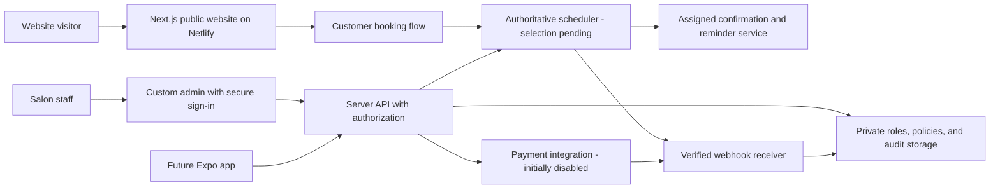

# Technology and scheduling recommendation

Researched September 6, 2026. Owner decisions: Netlify hosting, custom website admin, and payment/late-cancellation-fee controls built in MVP but disabled initially. Other technology/provider selections remain proposals; verify vendor plans again before purchase or implementation. Scheduling is currently manual and the budget is undecided.

## Recommended starting stack

| Layer | Proposal | Why and tradeoff |
| --- | --- | --- |
| Website | Next.js App Router + TypeScript | Pre-rendered marketing content plus a future server boundary for booking integrations. Built-in [metadata support](https://nextjs.org/docs/app/getting-started/metadata-and-og-images). More complexity than a purely static site, justified if the custom app roadmap proceeds. |
| Styling | Tailwind CSS + CSS design tokens | Consistent responsive layout and brand colors through [theme variables](https://tailwindcss.com/docs/theme). Custom design still needs deliberate typography and composition. |
| Motion | CSS first | Small decorative effects with reduced-motion support. Add a motion dependency only if an approved effect requires it. |
| Booking | Re-evaluate API-backed scheduling against custom-admin and payment requirements | One authoritative calendar for online and manual bookings. The former Square-first recommendation is suspended pending its cancellation-fee API limitation; hosted booking alone does not satisfy custom administration. |
| Content | Typed local content for launch | Simple, reviewable changes in GitHub. Owner edits require a developer initially; choose a CMS during planning if independent editing is a launch requirement. |
| Hosting | Netlify — owner selected | [Netlify supports Next.js through OpenNext](https://docs.netlify.com/build/frameworks/framework-setup-guides/nextjs/overview/), including App Router, caching, and image optimization. Evaluate Free for low usage; paid-plan choice requires owner approval. |
| Version control | GitHub | Documentation and code history, reviewable changes, and later CI. No repository visibility or account assumption. |
| Validation | TypeScript/lint/build; focused browser and accessibility checks | Validate critical journeys and vendor integration, plus metadata/performance. Tool versions will be selected when building is approved. |
| MVP admin/backend | Next.js server endpoints + managed authentication and PostgreSQL, Supabase candidate | Custom admin requires authenticated staff roles, private audit/policy storage, and server-authorized appointment writes now. [Row-level security](https://supabase.com/docs/guides/database/postgres/row-level-security) supports data access control; test actual policies. |
| MVP payment integration | Saved-card setup and later fees; Stripe Setup Intents is a candidate | Owner chose no upfront charge. Build card requirement/fee controls initially off. [Setup Intents](https://docs.stripe.com/payments/setup-intents) supports setup without initial payment; evaluate off-session consent, later charges, and scheduler compatibility before selection. |
| Future native app | React Native + Expo + TypeScript | [Expo](https://docs.expo.dev/) supports Android, iOS, and web development. Share types, validation, and API contracts; native screens still require separate design and implementation. |

The prior no-custom-backend plan is superseded by custom admin requirements. Propose managed auth and private storage for roles, policy versions, audit records, and processor references; confirm the data model after scheduler selection. Avoid duplicating appointment ownership in a second calendar. Keep customer accounts and provider customer IDs distinct: an ID alone does not establish authenticated ownership.

### Netlify deployment approach

Keep the proposed Next.js + TypeScript + Tailwind stack, with public content pre-rendered and lightweight client interactions. Use Netlify's supported Next.js adapter and validate its build output at implementation time. Pre-rendering through the adapter is not a promise of zero function invocations. Avoid unnecessary per-request rendering, live social feeds, or background jobs for the marketing site. Prefer responsive compressed images and provider-hosted scheduling. [Netlify Next.js documentation](https://docs.netlify.com/build/frameworks/framework-setup-guides/nextjs/overview/).

The future mobile app can reuse the secured API introduced for admin without changing the public website's host. Marketing pages remain pre-rendered; admin responses are private and authenticated. The authoritative scheduler handles availability/reservations, with notifications assigned explicitly to the selected provider or backend. A generic form submission is not a confirmed reservation.

After deployment approval, connect the intended GitHub branch, verify previews and production publishing behavior, and validate redirects, metadata, images, and booking links on Netlify. Keep any future server credentials in approved Netlify environment settings, with suitable scopes; never commit `.env` files or expose secrets to browser bundles. Do not create a Netlify site, enable paid options, or configure automatic production publication during planning.

Next.js remains the preferred website proposal now that a private admin interface is required. Backend alternatives are a managed scheduler with sufficient APIs or a custom scheduling engine backed by PostgreSQL. Custom admin does not by itself require a custom scheduling engine; compare their feasibility and full operating/maintenance costs before selection. Neither provider account setup nor custom engine implementation is authorized during planning.

## Provider shortlist

| Candidate | Verified capabilities | Main question before selection |
| --- | --- | --- |
| Square Appointments | Hosted booking entry/widgets; appointment APIs and staff tools with documented restrictions | Its Bookings API cannot book services with non-zero `no_show_fee`; demonstrate an approved path for custom admin, enabled fee policy, and future app before selecting. |
| Acuity Scheduling | Embedded scheduler, availability/appointment API, and appointment webhooks; email reminders, with SMS and API access depending on plan | Does a calendar per staff/resource match the salon? Custom API access is listed in Premium. |
| Fresha | Direct website booking links, team scheduling plans, reminders, and a consumer booking app | A public custom booking API suitable for our branded app was not verified. Obtain vendor confirmation of access, terms, and export before choosing for that roadmap. |

Square's [Bookings API documentation](https://developer.squareup.com/docs/bookings-api/what-it-is) distinguishes buyer-level operations from seller-level writes; the latter require eligible paid subscription access and permissions. Do not assume a free hosted booking setup guarantees future access to all appointments. Its [hosted booking documentation](https://api.squareup.com/help/us/en/article/5355-set-up-online-booking-with-square-appointments) supports website booking links/widgets.

Acuity provides [developer documentation](https://developers.acuityscheduling.com/), [change webhooks](https://developers.acuityscheduling.com/docs/webhooks), and documented [create/cancel/reschedule API use](https://help.acuityscheduling.com/hc/en-us/articles/16676949253389-Using-custom-CSS-and-APIs). Fresha documents [direct booking integration](https://www.fresha.com/help-center/academy/get-booked-online/accept-online-bookings/lessons/100349); its consumer app is not equivalent to a custom Madison Hill Nails app.

Revised recommendation: evaluate custom-admin operations and payment/fee behavior before choosing the scheduler. Square's [booking guide](https://developer.squareup.com/docs/bookings-api/use-the-api) restricts booking services with configured non-zero cancellation fees. Acuity and other candidates also need end-to-end verification; do not assume payment automation from general API availability. Custom admin may require paid API access immediately, even before the mobile app. The cheapest hosted-only plan is no longer a complete MVP cost estimate.

## Provider evaluation gate

After explicit approval for a sandbox/trial, demonstrate:

- Guest booking on a phone; accurate service price and duration, removal/add-ons, and eligible technician assignment.
- Successful no-payment booking with controls off; sandbox-tested collection, cancellation fee, waiver, refund, and reconciliation with controls on. Initial production state remains off.
- Two customers competing for one slot; a phone appointment competing with online booking; no silent overbooking.
- Manicure/pedicure combinations, buffers, chairs or other shared resources, and any multi-staff service.
- Staff breaks, holidays, minimum notice, maximum advance window, and Eastern time/DST behavior.
- Rescheduling and cancellation within and outside policy; original appointment preserved if a proposed move fails.
- Confirmations/reminders after booking, editing, canceling, and staff changes; a failed notification does not remove a successful booking.
- API rights to create, modify, and cancel the required appointments, including ones staff created; signed webhooks and export capabilities.
- Accessible mobile flow, usable fallback link, provider outage behavior, costs at actual staff count, and owner account ownership.
- Custom admin add/edit/cancel/block-time calls, same-slot race protection, owner-editable policy settings, and approximately seven-day cutoff capability. Fee calculation/collection must work through the actual intended integration, not only a vendor demo dashboard.

## Architecture by phase

Admin authentication/API, private storage, and payment/fee integration now belong to MVP; only the native app remains future in this diagram. Provider-hosted versus custom customer booking remains a feasibility decision. No backend or app is being provisioned during planning.

MVP API responsibilities: authenticate staff and enforce roles; authorize customer management operations; keep credentials server-side; validate requests; rate-limit abuse; use idempotency; enforce appointment conflicts; verify webhook signatures; deduplicate events; reconcile missed/out-of-order events; redact logs. The selected scheduler is authoritative for appointment state. A provider adapter isolates vendor-specific code but does not eliminate migration work. Full requirements are in [admin and payment controls](08-admin-and-payment-controls.md).

For a future custom reminder service, store appointment version, channel, consent/preferences, intended send time, and delivery state. Recheck the live appointment before sending, invalidate jobs after changes, and avoid duplicate provider/custom messages. A durable server-side worker sends reminders, independent of whether the mobile app is open. Push is optional with an email/SMS fallback according to customer settings. Review communication requirements when choosing channels; do not invent legal policy in this planning phase.

## Operating cost snapshot

USD, published prices observed September 6, 2026; excludes tax, payment processing, usage overages, implementation, maintenance, and optional purchases. These are planning inputs, not quotes.

| Component | Published starting point / budget treatment | Source |
| --- | --- | --- |
| Netlify | Free $0/month with 300 credits; Personal $9/month with 1,000 credits; Pro starts at $20/month with 3,000 credits. Confirm the owner's actual plan, including any legacy terms. | [Netlify pricing](https://www.netlify.com/pricing/) |
| Square | Free $0; Plus $49/location/month; Premium $149/location/month. Confirm current/legacy account entitlements and booking features. | [Square pricing](https://squareup.com/us/en/appointments/pricing) |
| Acuity | Monthly billing: Starter $20, Standard $34, Premium $61; annual equivalents $16/$27/$49 per month. Premium lists custom API; Standard/Premium list text reminders. | [Acuity pricing](https://www.acuityscheduling.com/pricing?btn=nav&entry_point=acuity) |
| Fresha | Independent $19.95/month; Team $14.95/bookable team member/month. Marketplace-acquired new clients carry a stated 20% one-time fee, minimum $6; distinguish direct bookings. | [Fresha pricing](https://www.fresha.com/pricing) |
| Domain | Domain-specific quote needed, including renewal; availability not checked | Pending domain choice |
| Admin/auth/private storage/payment operations | MVP cost now required; estimate after backend choice, including API tier, transaction/refund costs, webhooks, and support | Pending technical feasibility and payment mode |
| Photography, CMS, analytics, app distribution | Quote only if selected; no subscriptions proposed for purchase now | Pending scope |

Budget approach: keep hosting, scheduling/API access, admin/auth/database, payments, domain renewal, implementation, and maintenance separate. The owner has not set a spending cap; this does not authorize spending. Earlier hosted-only/free scenarios no longer represent this expanded MVP. Use the price table as vendor inputs, not a total quote; custom admin may need paid API access now and payment implementation adds work even when initially disabled. Low website traffic does not eliminate these operational costs.

Netlify usage is not determined solely by visitor count: metered usage includes production deployments, bandwidth, requests, and compute. Its published pricing says exhausted limits can pause projects; keep usage monitoring in the launch checklist. Evaluate Free before selecting a paid plan and leave paid recharge/purchases unapproved until the owner decides. [Netlify pricing and usage FAQ](https://www.netlify.com/pricing/).
