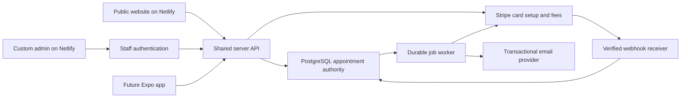

# Architecture recommendation and MVP backlog

> Historical planning proposal. The [current approved scope](10-approved-build-scope.md) and [implemented build](11-build-and-operations.md) supersede conflicting scope, authentication, payment, and cost assumptions below.

September 6, 2026. Status: concrete proposal for owner approval, not permission to implement or provision services. The recommendation below follows the confirmed custom admin and saved-card requirements. Existing [product requirements](01-product-plan.md) and [admin/fee requirements](08-admin-and-payment-controls.md) remain the acceptance baseline.

## Recommended architecture

Use Next.js + TypeScript + Tailwind on Netlify for the website and private admin. Use Supabase Auth for staff identity, PostgreSQL as the single appointment database, and a custom server-side scheduling service for availability and appointment changes. Use Stripe for card setup and later authorized cancellation fees. Introduce a transactional email provider and a durable notification queue for booking messages and basic reminders; select the sender/worker after evaluating delivery, scheduling, and cost requirements.

This is a recommendation to build scheduling logic, not a claim that Supabase includes a ready-made salon scheduler. Staff/resource availability, reservation conflicts, cancellation policies, notifications, and the admin interface become our implementation and maintenance responsibilities. Low traffic makes a modest infrastructure footprint plausible, but does not make the scheduling/payment logic trivial.

| Choice | Fit for this project | Tradeoff |
| --- | --- | --- |
| Custom booking backend with Supabase + Stripe — recommended | One shared calendar and policy model across web/admin/future app; custom owner settings and saved-card lifecycle | More implementation, testing, operational monitoring, and ongoing support |
| Managed scheduler API plus custom admin | Provider owns core scheduling, potentially reducing our operational work | Must prove all required admin, capacity, fee, and future app operations; subscription/API restrictions remain |
| Provider-hosted booking and provider dashboard | Fastest route to basic online appointments | Does not meet the owner-confirmed custom website admin requirement on its own |

The recommendation is based on fit with the selected workflow, not on an assertion that all managed products are unsuitable. The [technology comparison](03-technology-and-booking.md) retains the managed options and Square's documented fee restriction. If the owner prefers less custom software, validate a managed candidate before choosing that path.

### Responsibilities

| Component | Owns | Must not own |
| --- | --- | --- |
| Public Next.js pages | Salon content, SEO, gallery, booking entry | Customer records or private admin responses in public caches |
| Booking/admin server API | Validation, permissions, scheduling commands, fee eligibility | Raw card storage or long-lived in-memory jobs |
| Supabase Auth | Staff sign-in/session identity; owner MFA design | Sole authorization by a user-editable role field |
| PostgreSQL | Authoritative appointments, occupied resources, policies, audit entries, work queue | A second copy competing with a provider calendar |
| Stripe | Payment method vault, setup result, charge/refund result | Deciding salon cancellation policy or appointment availability |
| Notification worker/provider | Claimed email jobs, retries, delivery results | Changing appointment status because an email failed |
| Future Expo app | Native customer experience | Separate booking rules or a separate appointment database |

[Supabase Auth](https://supabase.com/docs/guides/auth) supplies authentication primitives. Role checks, database access policies, account recovery, session handling, and authorization tests still require deliberate implementation.

With card/fee controls off, ordinary booking uses the API and database without contacting Stripe. Payment integrations should not prevent no-card booking when those features are disabled or test credentials are absent.

## Proposed data model

This is a logical model only; no database schema or migration is being created.

| Entity | Purpose |
| --- | --- |
| Location | Salon timezone and public identity; one location initially |
| Service / service version | Duration, price, buffers, bookability, eligible staff/resource requirements |
| Staff identity / role / service eligibility | Separate application permissions from who can perform services |
| Working hours and availability exceptions | Regular hours, holidays, time off |
| Customer contact | Minimum booking contact information, privately stored |
| Appointment | Service/price/duration snapshot, source, lifecycle status, revision, policy version |
| Resource reservation | Occupied interval for a technician or exclusive resource, including buffers; links to an appointment or time block |
| Temporary reservation | Pending card-setup expiry and ownership; reserves capacity until confirmed or released |
| Booking policy version / acceptance | Card rule, fee rule, deadline interpretation, amount calculation, and recorded acknowledgement |
| Payment references | Processor customer/setup/payment-method identifiers and limited display fields; no raw card numbers/CVC |
| Cancellation fee / refund record | Eligibility decision, amount, waiver reason, collection/refund state, processor references |
| Audit event | Actor, action, timestamp, object revision, minimal change details |
| Outbox job / webhook receipt | Durable work and event deduplication; no secret values or full unnecessary payment payloads |

Appointment snapshots prevent a later price/duration edit from silently changing an existing booking or fee base. Role data must be controlled by an authorized owner/server operation, not arbitrary client profile edits.

## Preventing double booking

Availability search is a convenience for choosing a time; only a successful database transaction reserves it. Online and admin commands must call the same scheduling service.

Use half-open occupied intervals: start is included, end is excluded. Include setup/cleanup buffers in the reserved interval so back-to-back bookings are only allowed when capacity permits. Store instants and display them in salon time; weekly working-hour rules are evaluated in the salon timezone, including DST validation.

For each exclusive technician/resource, enforce non-overlap in the database using range/exclusion constraints or an equivalent transactional design. PostgreSQL documents range exclusion constraints for non-overlapping reservations in its [range types guide](https://www.postgresql.org/docs/current/rangetypes.html). This is the proposed enforcement mechanism; exact constraints and supported extensions must be verified during implementation.

All occupied capacity, including admin blocks, uses the same reservation model. For capacity greater than one, assign concrete resource units where appropriate, or implement an explicitly locked capacity calculation; a single non-overlap constraint does not model a multi-capacity pool by itself. Confirm chairs and staffing before choosing the model.

Create appointment, resource reservations, audit event, and notification job atomically. If two requests compete, one succeeds and the other receives a conflict with refreshed choices. Reserve resources in a stable order and handle retryable database conflicts. A reschedule changes the old/new reservations in one transaction; a failed move retains the original appointment.

Use appointment revisions to reject stale admin edits. Changing staff hours or services must identify affected existing bookings and require an explicit reconciliation decision instead of invalidating them silently.

Temporary card-setup reservations need explicit state and expiry. Expiry must be materialized by a transaction/worker; do not assume a database constraint using the current time will automatically release a row. Availability and writes must agree about expired reservations. Recheck ownership, expiry, resource availability, and appointment revision before converting to confirmed. A late card-setup event must never revive an expired booking or take a slot already assigned elsewhere.

## Guest and admin access

Customers can book without creating a website account. Issue an unguessable, limited-purpose management link; store only its hash, support expiry/revocation, and exchange it for an appropriate session without exposing tokens to analytics or third-party referrers. Never authorize changes by sequential appointment ID, email address alone, or possession of a Stripe customer ID.

Staff sign in individually. Proposed roles are owner and appointment manager; introduce technician-limited views only if needed. The owner controls roles and financial settings. API operations check permissions server-side, and database policies restrict direct access. Privileged backend credentials, if needed, stay server-side and do not substitute for authorization checks.

Private admin/customer responses use private/no-store caching as appropriate and noindex. Public availability returns times and approved service/staff data, never customer names or appointment notes. A safe public error response should not reveal why another customer occupies a slot.

## Saved-card and fee lifecycle

Card requirement and cancellation-fee collection are independent owner settings, both initially off. Policy versions record which rules the customer accepted. Existing appointments without card/fee authorization remain exempt from automatic collection unless a separate valid agreement is obtained.

When card setup is required, the server creates a temporary reservation and a processor setup session linked to the verified customer/reservation. Customer-facing copy states no upfront charge and displays the applicable fee agreement. [Stripe Setup Intents](https://docs.stripe.com/payments/setup-intents) supports saving payment methods without an initial charge; later off-session use requires the corresponding agreement and a recovery path for failed or authentication-required charges.

On verified setup success, confirm the reservation only if it is still valid. Verify processor customer, object ownership, status, and live/test mode; never accept arbitrary client-supplied payment-method IDs. Failed or abandoned setup releases pending capacity under the approved expiry rule.

Cancellation transaction: record the server-received request time, evaluate the accepted policy snapshot, cancel the appointment, release capacity, write the audit/notification events, and create at most one fee-assessment record. Collection happens through a durable job after commit, using a stable idempotency key. The cancellation itself remains valid if the charge fails.

Before attempting a charge, recheck that the assessment is still eligible, authorized, not waived, not already collected, and allowed by the current collection controls. Disabling collection stops new automatic attempts; already submitted processor requests may still settle and must be reconciled. Define future handling of previously assessed unpaid fees before re-enabling; never bulk-charge them implicitly.

If staff-reviewed enforcement is chosen, assessment creates a review item instead of a charge job. Exact cutoff, fee amount/base/cap, late-reschedule treatment, waiver permissions, and enforcement mode are still pending. No sample amount or example seven-day boundary becomes an active policy.

Webhook endpoint: verify signatures using the raw request body, record unique processor event IDs, acknowledge after durable receipt, then process with retries. Do not assume event delivery order or that an event appears only once; reconcile current object status before applying changes. [Stripe webhook guidance](https://docs.stripe.com/webhooks).

## Notifications and operational jobs

For this custom-backend proposal, basic confirmations, changes, cancellations, and the proposed email reminder move into our MVP workflow; they are not supplied automatically by a scheduler we no longer use. SMS, push, and marketing messages remain later decisions.

Write notification jobs in the same transaction as appointment changes. A scheduled worker claims jobs durably, sends through the chosen provider, records results, and retries transient failures. Recheck appointment revision/status before reminders; cancel or supersede obsolete jobs. Use delivery deduplication and do not promise exactly-once email delivery where the provider cannot support it.

Select a worker mechanism with durable state, bounded execution, authenticated triggering, and monitoring. An in-memory timer in a Netlify request is insufficient. Define retry limits, staff-visible failures, and replay procedures. Include pending-reservation expiry, payment reconciliation, and card-setup cleanup in the operational job inventory.

## Prioritized MVP backlog

All items are planned, not started. Sequence reflects dependencies, not guaranteed dates. The owner approves implementation only after reviewing design and architecture.

| Order | Work package | Done when | Depends on |
| --- | --- | --- | --- |
| 0 | Approve architecture and scheduling assumptions | Stack, staff/resource model, budget approach, and unresolved policy placeholders accepted | Owner review |
| 1 | Static visual mockups | Desktop/mobile homepage, booking, and admin calendar/settings views approved; disabled card/fee state explicit | Design-phase approval |
| 2 | Repository/app foundation | Next.js/TypeScript/Tailwind setup, appropriate checks, secret protections retained, environments separated | Build approval |
| 3 | Auth and database foundation | Staff roles, private access, migration strategy, backup/restore plan, audit model verified | Backend approval/account setup |
| 4 | Scheduling service | Availability, create/edit/cancel/block commands, snapshots, revisions, concurrent-write tests pass | Service/staff/resource inputs |
| 5 | Custom admin | Calendar/list/detail/actions and settings work against shared commands; roles and stale-state behavior verified | 3–4 |
| 6 | Customer booking and management | Guest booking and secure change/cancel flow pass desktop/mobile checks | 4 and management-link delivery |
| 7 | Transactional messages and jobs | Confirmation/change/cancel/reminder flows, expiry/retry/recovery behavior verified | 3–6 and sender setup |
| 8 | Saved-card and fee integration | Sandbox tests cover on/off, setup failure, cutoff boundaries, waivers, duplicate events, declines, refunds; production controls off | Payment mode confirmed; remaining fee rules needed |
| 9 | Marketing content, SEO, accessibility | Approved one-page content and policy routes, optimized imagery, reduced motion, metadata, indexing rules | Approved copy/assets; can run alongside 3–8 |
| 10 | Integrated acceptance and staff rehearsal | Manual/online races, end-to-end journeys, authorization, recovery, and staff handover pass | 4–9 |
| 11 | Approved launch on Netlify | Owner-approved cutover, domain, deployment, usage alerts, backups, booking verification; fees/card requirement remain off | Explicit launch approval |

UI preferences should not block backend planning. Missing service/staff/policy facts must remain explicit inputs, not invented seed data labeled as the salon's real operation. Fees can be sandbox-tested with clearly synthetic configuration while production activation remains unavailable until its policy is complete.

## Cost planning

Supabase currently lists Free at $0 and Pro from $25/month; Free projects can pause after a week of inactivity, while Pro includes daily backups with seven-day retention. This makes a paid production database worth budgeting for an appointment system even at low traffic. [Supabase pricing](https://supabase.com/pricing).

Illustrative infrastructure starting point: Netlify Free if suitable plus one baseline Supabase Pro project means about $25/month before domain, email, payment-related charges, additional environments/projects, overages, implementation, and maintenance. It is not a complete quote or spending authorization. Use the separate [hosting price snapshot](03-technology-and-booking.md) and confirm actual account terms before purchasing.

Stripe transaction/service costs and transactional email pricing still need a scoped comparison; do not describe the entire saved-card system as free merely because no upfront customer payment is collected. Development effort is higher than the earlier hosted-widget proposal and should be estimated after staff/resource rules and fee enforcement are settled.

## Approval requested next

Approve or revise this architecture recommendation before implementing the booking engine or provisioning accounts. The next design phase would produce static homepage, booking, and admin mockups; that also requires owner approval. The current deliverable is documentation only, with no application, schema, API, test charge, or deployment created.
